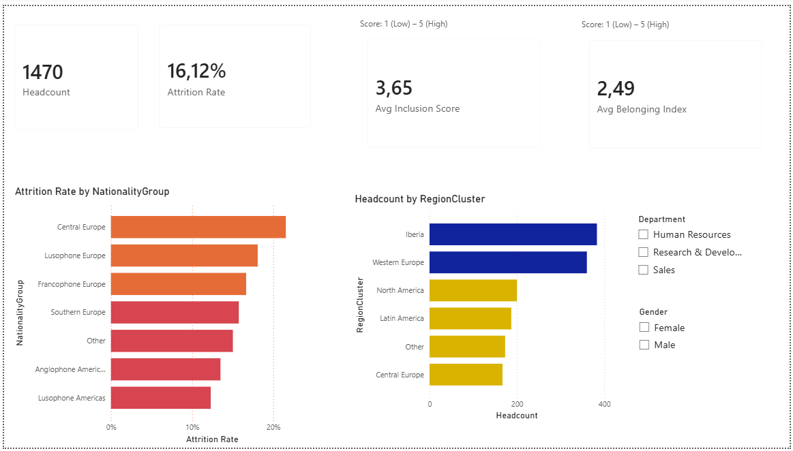
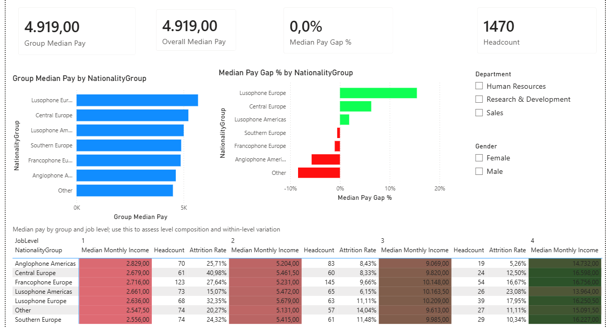
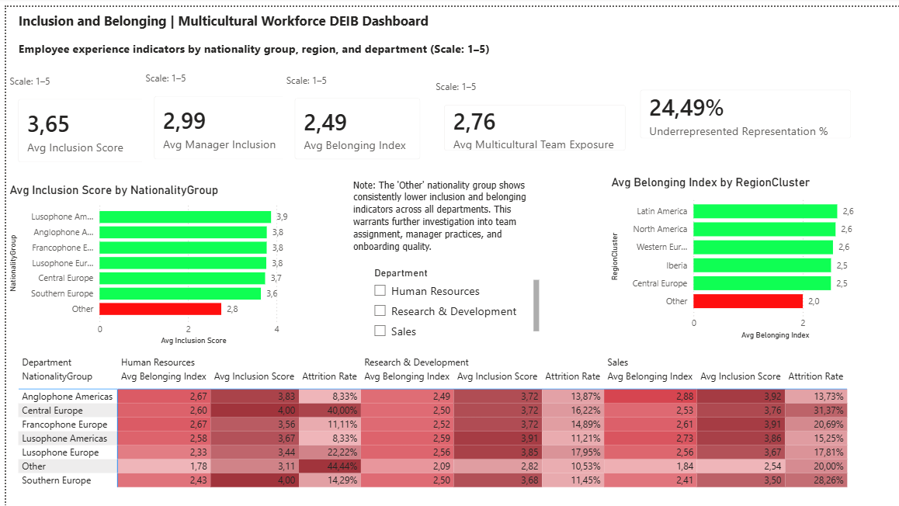

# Multicultural Workforce DEIB Dashboard | Power BI

**Power BI People Analytics and DEIB dashboard analyzing multicultural workforce inclusion, pay equity, and attrition.**

A Power BI case study analyzing a multicultural workforce through the lenses of headcount, attrition, pay equity, inclusion, belonging, and representation.

---

## Project Overview

This project explores how workforce diversity, compensation, and employee experience interact in a multicultural organization.  
It was built in Power BI using an enriched HR dataset and designed to demonstrate advanced People Analytics and DEIB thinking.

The dashboard is organized into three pages:
1. Workforce Overview
2. Pay Equity by Diversity Group and Job Level
3. Inclusion and Belonging

---

## Business Questions

- How is the workforce distributed across nationality groups and regions?
- Which groups show the highest attrition risk?
- Are there pay differences across diversity groups and job levels?
- Do inclusion and belonging scores vary by nationality group, department, or region?
- Which groups may need closer DEIB attention?

---

## Dataset and Method

The dataset is based on an HR attrition dataset enriched with multicultural and DEIB-related variables such as:

- NationalityGroup
- CountryOfOrigin
- RegionCluster
- PrimaryLanguage
- MulticulturalTeamExposure
- InclusionSurveyScore
- ManagerInclusionScore
- BelongingIndex
- UnderrepresentedGroup
- PayBand

The analysis is descriptive and exploratory.  
Because the dataset is synthetic/enriched, the findings should be interpreted as portfolio insights, not as causal claims about a real organization.

---

## Dashboard Pages

### Page 1 — Workforce Overview

This page provides the executive summary of the workforce.

**Key visuals**
- Headcount
- Attrition Rate
- Avg Inclusion Score
- Avg Belonging Index
- Attrition Rate by NationalityGroup
- Headcount by RegionCluster
- Department and Gender slicers

**Main insight**
- The workforce is multicultural, but attrition and employee experience are not evenly distributed across groups.

---

### Page 2 — Pay Equity by Diversity Group and Job Level

This page examines pay equity using median monthly income.

**Key visuals**
- Group Median Pay
- Overall Median Pay
- Median Pay Gap %
- Headcount
- Group Median Pay by NationalityGroup
- Median Pay Gap % by NationalityGroup
- Matrix by NationalityGroup and JobLevel

**Main insight**
- Pay differences are not uniform across groups, and job level helps explain part of the variation.

---

### Page 3 — Inclusion and Belonging

This page focuses on employee experience and DEIB outcomes.

**Key visuals**
- Avg Inclusion Score
- Avg Manager Inclusion
- Avg Belonging Index
- Avg Multicultural Team Exposure
- Underrepresented Representation %
- Avg Inclusion Score by NationalityGroup
- Avg Belonging Index by RegionCluster
- Heatmap matrix by NationalityGroup and Department

**Main insight**
- Inclusion and belonging vary by group, and some segments show weaker employee experience signals than others.

---

## Key Findings

- Central Europe shows the highest attrition rate among the nationality groups.
- The "Other" nationality group has the weakest inclusion and belonging indicators.
- Underrepresented employees represent about 24.49% of the workforce.
- Lower job levels show the largest pay variation.
- Manager inclusion is an important signal in explaining belonging differences.

---

## Technical Approach

- Power BI data modeling
- DAX measures for attrition, pay equity, inclusion, and belonging
- Conditional formatting for risk highlighting
- Matrix heatmaps for group comparison
- Slicers for interactive filtering
- Median-based pay analysis for more robust comparison

---

## Limitations

This project uses an enriched synthetic dataset.  
The DEIB-related fields were created for portfolio analysis and do not represent a real organizational audit.  
All conclusions are descriptive and should be interpreted as analytical patterns, not causal proof.

---

## Tools Used

- Power BI Desktop
- DAX
- Power Query
- Excel
- Star Schema modeling

---

## Author

**Ake Marc Albert Adjé**  
People Analytics & DEIB Specialist | Power BI | Intercultural Relations | FR/PT/EN

- LinkedIn: [Ake Marc Albert Adje](https://www.linkedin.com/in/ake-marc-albert-adje-5b341a110/)
- Portfolio: [datascienceportfol.io/akemarcpt](https://www.datascienceportfol.io/akemarcpt)
- Email: akemarcpt@gmail.com
